# Final Project: ZoGolf
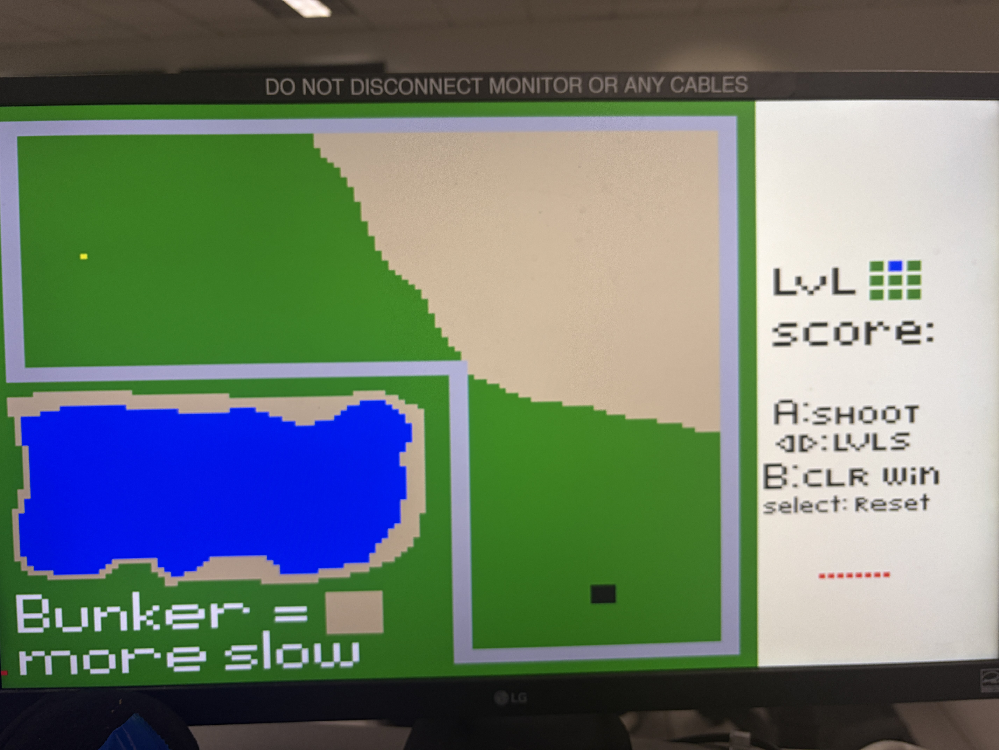
## Introduction
The objective of this final project is to demonstrate what I have learned in ECE 383 regarding designing and implementing hardware and software onto a Diligent Nexus Video. This implementation will be used in an arcade machine for the ECE department. I will demonstrate this by making a 2d top-down golf game that utilizes a trackball, Nintendo controller, and monitor to control and display the game. 

## Design
### High level system
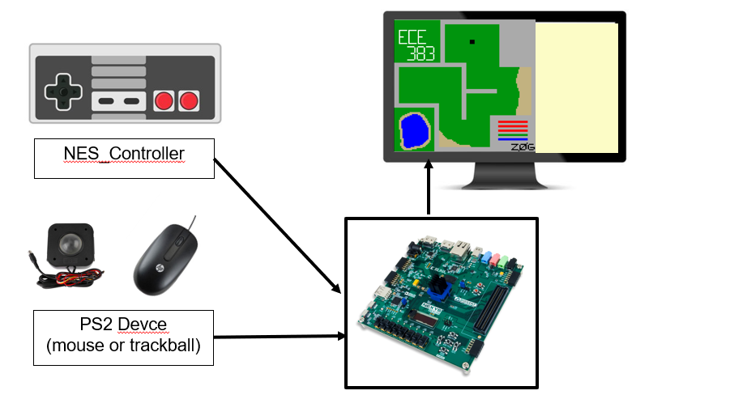
A PS2 device and NES controller are used to control a Nexys Video FPGA board. The FPGA handles hardware signals and hosts a MicroBlaze module to control game logic. The FPGA uses HDMI to output a 480x600 video signal containing the game and a scoreboard.

### Hardware Subsystem
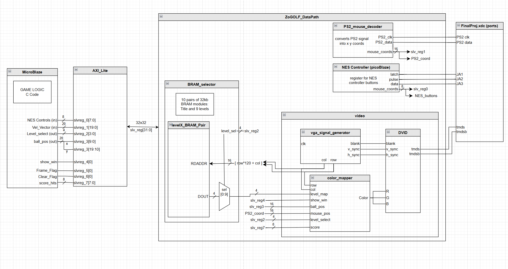
The video module consists of the vga signal generator and DVID components from lab 1 along with a new color mapper built specifically to interact with BRAM and outputs from the micro blaze to display the game. [see section 2.3 for video layout and level designs]

The AXI_Lite module and slave register system allows the BASYS board hardware and MicroBlaze software to communicate.
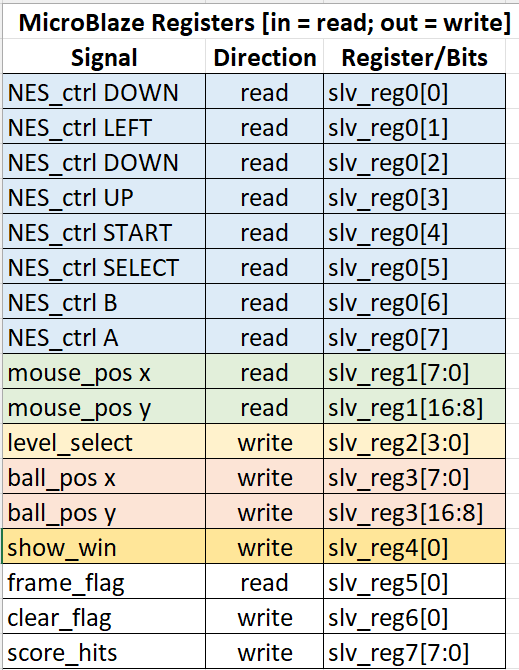

Graphics for the Title screen and 9 levels will be stored in BRAM. A 3-bit color system will be used to conserve memory and encode the 8 color values used for the levels:

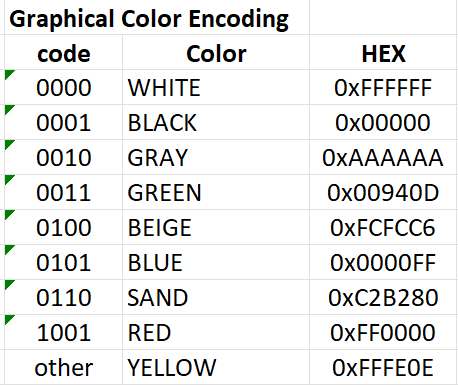

Levels are designed with 120x120 grid for actual level components which are then upscaled to the 480x480 pixel section of the video signal. Each level is stored in separate BRAM pairs whose output is controled by the MUX in the BRAM_selector component.

The Graphical Map in the BRAM will have a corresponding “software map” within the microblaze which will be an array of characters representing the walls, greens, bunkers, and hole locations within the level. This array will be used for calculations involving the ball when it is in motion.

### Software Subsystem
Below is the FSM and output table for game logic and hardware control:
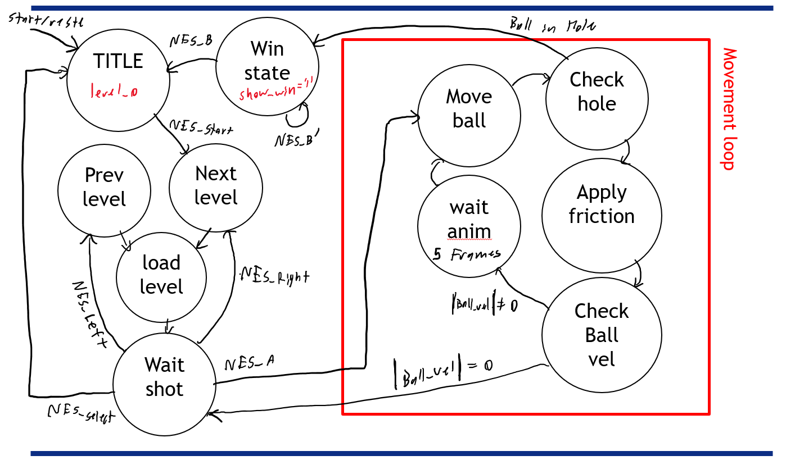

The game will start on a title screen (level 0). When the user pushes START on the NES controller, the FSM loads the first level of the game and then waits for the user to align their shot using the PS2 mouse. When the user is ready to take their shot, the FSM enters an action loop that continues to move the ball along its current velocity, bouncing off of walls and applying friction, until the ball either has no more velocity or hits the hole. If the ball hits the hole, the FSM tells the color mapper to display the win message and prompt the user to move to the next level by pressing B on the NES controller. If the ball reaches a velocity of 0 without hitting the hole, the game will wait for another shot. The game will add 1 to the score_hits tracker upon the ball hitting the hole successfully or stopping.

The "friction" state applies friction to the ball depending on if it it touching a GREEN or SAND zone. sand will apply a higher degree of friction, slowing down the ball more rapidly.

Within the action loop, the Wait_anim state waits for a 5 frames before doing the next movement on the ball. This will effectively “animate” the ball as a shot is being processed rather than having the ball just teleport to its final position from that shot. This utilizes the frame_flag register to cause system interrupts in the MicroBlaze to count the amount of frames that have passed.

During the wait_shot state, the user can use the NES Left and Right buttons on the D_pad to navigate levels, or go to the menu and reset the game by pressing SELECT.

### Calculations/Analysis/Drawings
Below is the video signal layout for the game
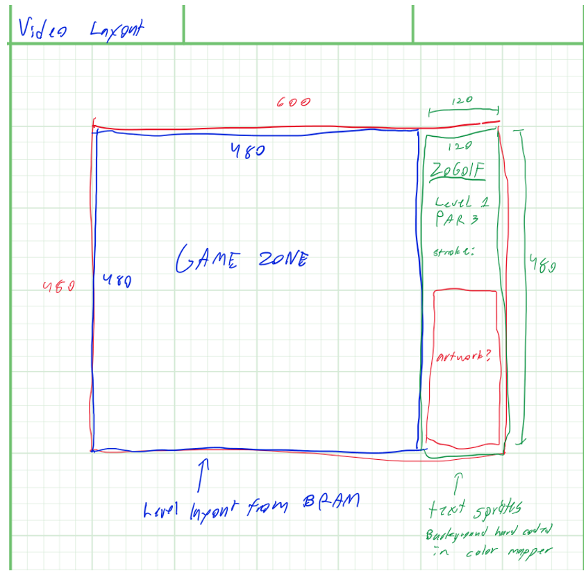

The ball_position and mouse_pos registers are each a size of 16 bits with 8 bits each dedicated to x and y values. we will keep the ball and mouse cursor within the 480x480 play space, limited to only a 120x120 grid of possible positions.

Below are the rough sketches of the 9 levels of the game. the red circle indicates the balls starting position, blue circle indicates the hole, and purple represents bunker zones. The actual levels varied slightly from this plan, but are mostly the same. level 4 and level 2 are swapped in the actual implementation.
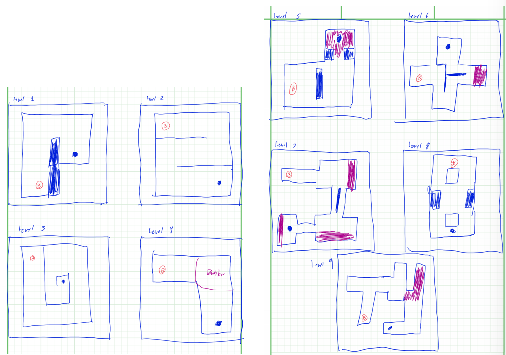

## Milestones and Functionality Requirements
Milestone I:
Get the hardware all working together… with the VGA signal writing to HDMI, the mouse being displayed and able to be properly moved around using a ps2 signal, and an indicator that the NES controller is sending inputs (Left Right Up Down, start, and A B buttons). This will utilize a testbench program with a unique color mapper configuration specifically for this.

Milestone II:
Hook up the hardware package to the MicroBlaze, and use the MicroBlaze to draw a level and the ball through the HDMI port. Ensure the color mapper is drawing the cursor, ball, and level with the correct priorities. No game logic required for this Milestone.

Required Functionality: 
Overall, the game starts on and runs a single golf level where the trackball is used to aim the ball and a button on the NES controller is used to hit the ball. The Level simply resets when completed (when the ball hits the hole). A microblaze interface is utilized to handle the game logic such as level layout and ray calculations while the FPGA board is utilized for hardware interface with the trackball and controller. A VGA signal is made using a color mapper to display the game screen via HDMI to a monitor (level layout, current ball location, hole location, cursor, non-functional scoreboard).

B-Level Functionality: 
Title screen and multiple levels with selection added to the game. Levels can be navigated using the NES controller and the title screen (represented as level 0) serves as the start/reset state of the game.

A-Level Functionality: 
A method for keeping track of score (which is displayed to the player) added to the game. Additionally a ray is drawn from the cursor to the ball to indicate the direction it will be hit towards. 

## Functionality
Required functionality was achieved in ZoGolf_V2 on May 5th. The title screen and Level 1 were fully functional with a win condition for hitting the hole, ball vector logic, logic for handling bounces off of walls, and the ability to navigate between levels (though no others existed yet). At this time there was a bug where the ball would always travel at 45 degrees.

B level functionality was fully achieved in ZoGolf_V2 on the morning of May 7th. The 45 degree angle bug was caused by an oversight in the ball movement logic and was fixed. 8 more levels and an indicator for which one was selected were added, and the ability to navigate between them was confirmed during testing. Differing friction between sand bunkers and green was implemented at this stage.

A level functionality was partially achieved in ZoGolf_V5 on the morning of May 7th. A level selection register and hashmark system was add to the game to track the first 25 hits the player attempts. Though no sprite system was added, more BRAM modules were utilized in the hardware to display labels for the level selection and score of the game. A legend for the controls for the game was also added using a BRAM module. These “sprite” were able to be used with the same design as the level BRAM components since they were in a 120x120 format regulated to the scoreboard side of the display. The ray visual between the cursor and ball was scrapped due to time constraints and overall scope of the project.

## Testing and Results
The first major testing for milestone I involved getting the NES controller, HDMI video output, and PS2 mouse working properly. The test output is shown below:
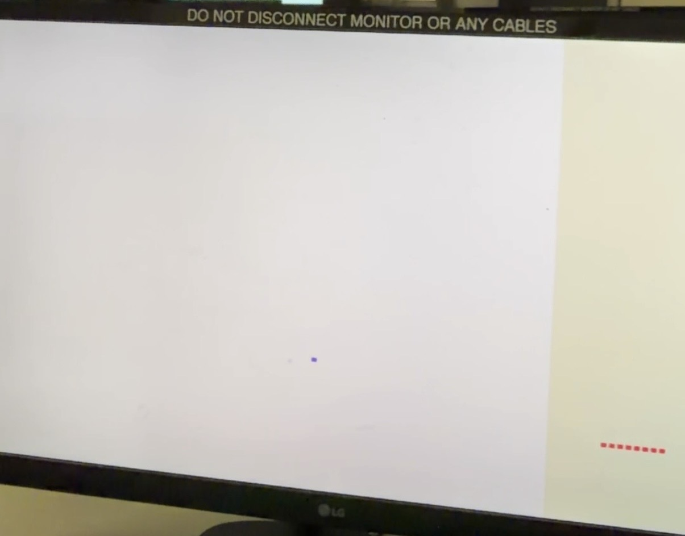

The 8 red pixel chunks in the bottom left of the screen turn blue to indicate the NES controller buttons being pressed. The Blue cursor in the white area of the screen takes live PS2 mouse input and moves around that area. Lastly, the white screen is being loaded from BRAM memory. At the time, this BRAM was actually not working as intended (shown below), which was discovered when actual images were input into the BRAM. These bugs were related to a faulty function that converted pixel coordinates into BRAM memory addresses. These bugs were quickly addressed when the first images were encoded into BRAM.
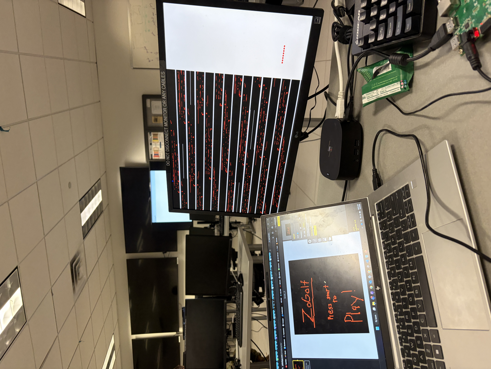
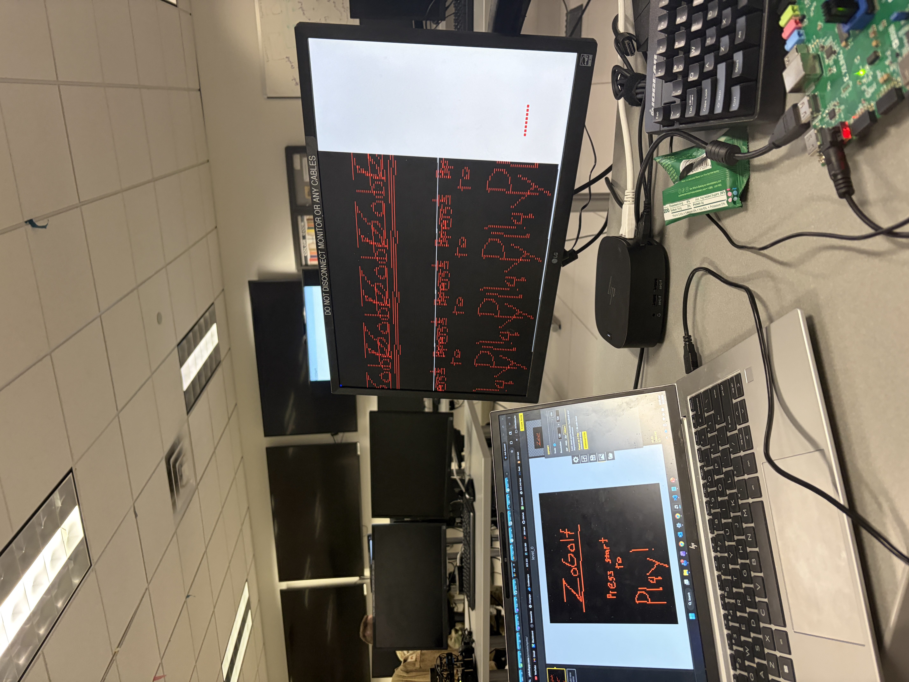

For milestone 2, the main goal was to integrate a MicroBlaze into the system and ensure that values were being passed correctly through the slave registers. The biggest obstacle during this phase was the PicoBlaze component in the NES controller hardware was trying to occupy the same JTAG space as the MicroBlaze Debugging Module, which prevented the bitstream from generating for the hardware implementation. With the help of Col. Trimble, the JTAG register was able to be disabled in the PicoBlaze. After getting over that hiccup, a very basic hardware test and some functions for handling communication with the slave registers was coded in the MicroBlaze. The NES controller values were being passed, the ball and mouse cursor were linked with a slight offset, and the limits of the functions were tested to ensure no invalid values were sent to the slave registers. Testing was very quick and successful for this Milestone.

Required functionality just involved C coding, no hardware modifications or testing was needed
For A and B level functionality, the main issues arose from the new hardware being added. The new levels worked first try in V3 of the project, and required only minor additions to the code to handle the switching between levels. On the other hand, multiple hardware revisions were required to get the new scoreboard and legend BRAM modules working
Below are images of the title screen and level 9 of the fully functional game: ZoGolf!
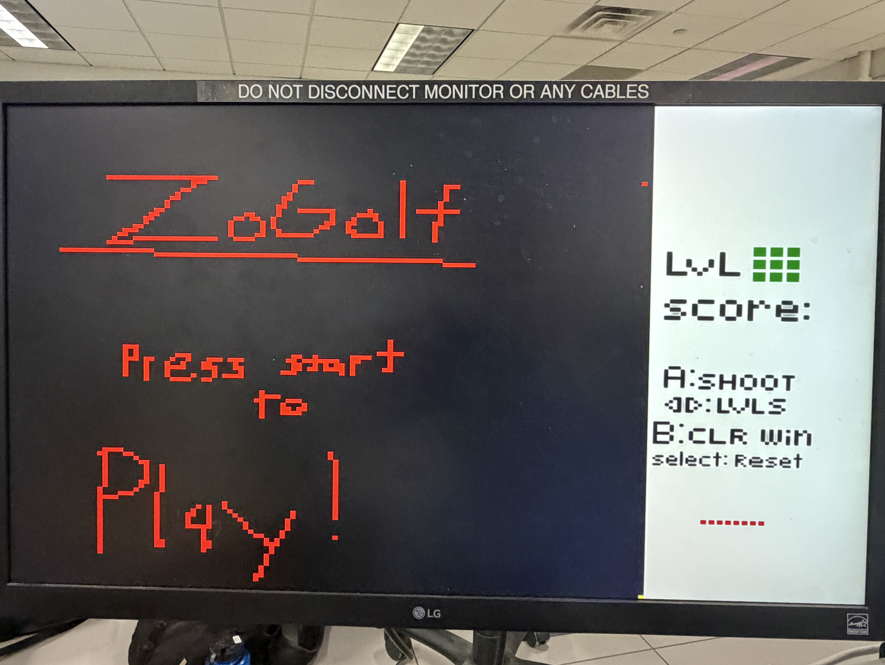
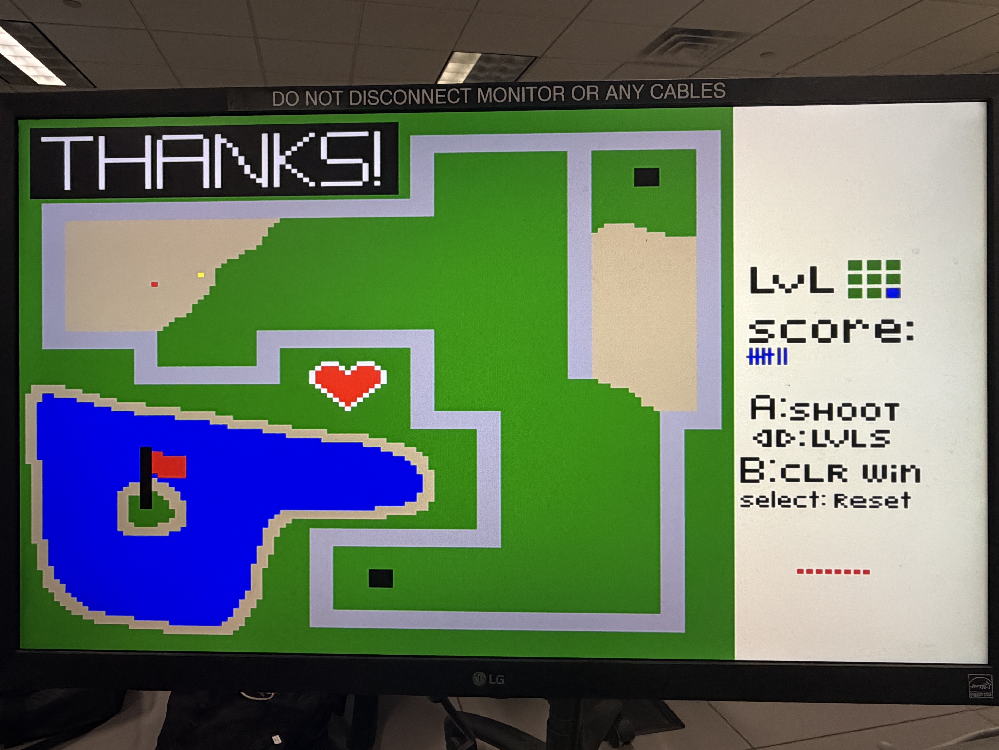

## Conclusion
This project was a blast to do. Implementing the hardware, especially the Microblaze, took a lot of debugging and testing to get working properly. Once that was accomplished, the coding for the game went quickly. I learned how to utilize documentation and schematics for hardware in an efficient matter due to the time constraint on this Final Project. I am super excitd to see ZoGolf running on the ECE departments arcade cabinet in the future!

# Appendix
## Appendix A: Running the Project 
Once you load the bitstream file onto the FPGA board, wait for roughly 2 seconds for the game’s FSM to initialize. Then, press START on the NES controller to go to the first level of the game. 

You can navigate the levels at any time the ball is not in motion or in the hole using the left/right arrow buttons on the NES controller. 

To shoot the ball, align the red mouse cursor using the PS2 ball mouse (or normal mouse) as if you are hitting from the cursor to the yellow ball. The further away the cursor is from the ball, the more powerful the shot will be. To take your shot, press and release the A button on the NES controller. The game will not take any inputs while the ball animation is playing out. Once the ball stops, you can hit it again or navigate levels as usual.

Watch out for SAND bunkers! SAND pixels apply more friction to your ball compared to GREEN pixels.

Once you make the ball in the hole, a win message will be displayed. The game will be frozen until you press and release the B button on the NES controller. The game will then load the next level, and play continues as usual. Pushing B after completing level 9 will just reset level 9.

Lastly, when the ball is not in motion or in the hole, press SELECT on the NES controller to reset the game to the title screen.
 
## Appendix B: Arcade Cabinet files 
I was unable to successfully integrate the ELF file into the bitstream, but the Vivado project is in "ZoGolf_IP" folder and ELF file is within the "FinalProj_vitis" folder. "ZoGolf_preview.png" is the a preview for the Arcade Cabinet.

