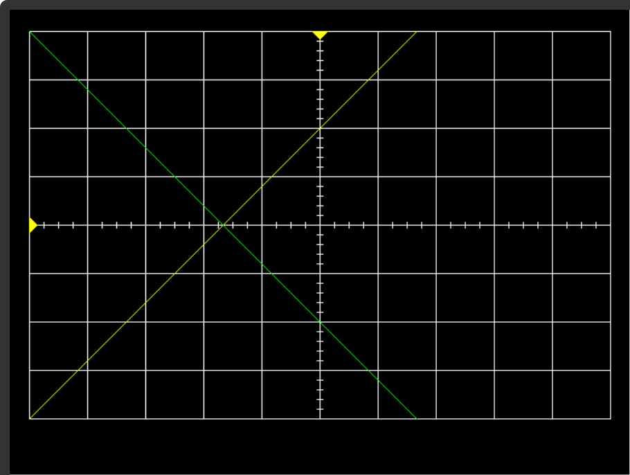
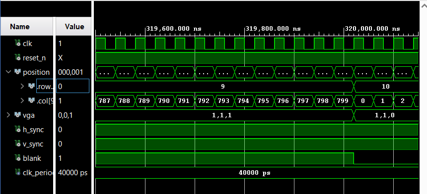

# REPORT

## introduction
For this lab, I was tasked with writing a vga controller in VDHL and implementing it onto an FPGA development board. I then used this VGA controller to display an oscilloscope with two signals, a white with hashes, and moveable trigger indicators as shown below.

.

## Design and Implementation

## Test/Debug

This project utilized 3 test benches to verify the individual functionality of the counter, vga_signal_generator, color mapper, and numerical stepper components. 

Instructor_tb generated a visual waveform and tested key values for the implementation of the counter and vga_signal_generator components. This ensured that the componentes generator the correct VGA signal for our 480x640 pixel display, with the correct coordinates and v_sync, h_sync, and blank signals for the coordinates as shown in 'VGA test signal' images below.

.

This screenshot below shows the hsync and blank signals reacting to the column count
.

This screenshot below shows the vsync and blank signals reacting both the column and row counts
.

vga_log_tb produced a text file containing the vga signal data with colors from the color_mapper component. This file could then be placed into a program to ensure the oscilloscope display would be rendered properly before integrating onto hardware. the screenshot below shows the output from this testbench after the components were coded.

In gate check two (instructor_tb), I ran into multiple problems where signals were updating a clock cycle too late, causing unwanted behavior with the blank signal. This was due to logic errors within my my ranges for each signals duration in vga_signal_generator. Adjusting these ranges down by 1 fixed the problem.

When I completed all parts and started generating the bitstream for the FPGA board, I failed multiple times due to improperly connecting signals and components in the lab1.vhd file. Most of these issues resulted from me copy/pasting code from other source files and forgetting to adjust the right values/ Thanks to the error messages these were easy to find and fix, yet this taught me to be more methodical when writing the top-level code for projects like this in the future.

I found out that different monitors can yield unexpected results with the HDMI interface. My two personal monitors both had unique issues diplaying the signal from the FPGA board that worked perfectly on the monitors in the lab. my 1080p portable monitor only displayed in black and white, as well as squashing the image to only the top-half of the monitor, and my 1440p gaming monitor refused to display anything despite the power being on. I'm curious as to why these monitors behaved in this way.

## Results