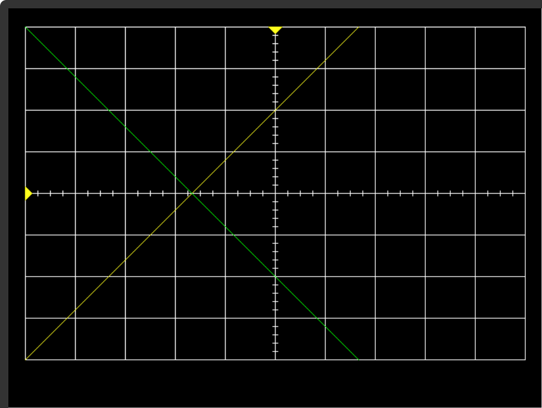
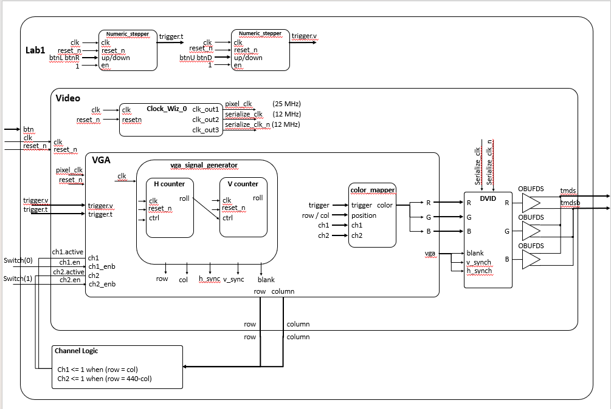
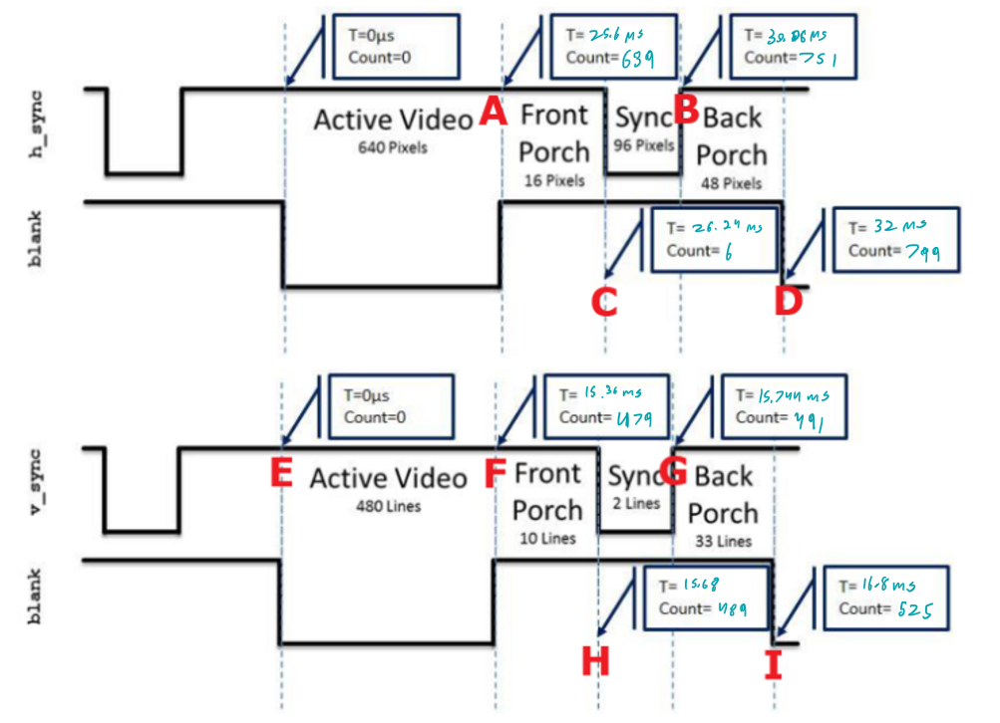
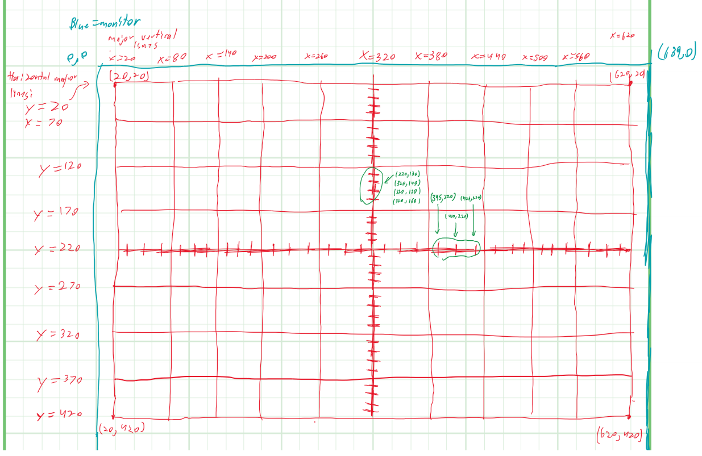
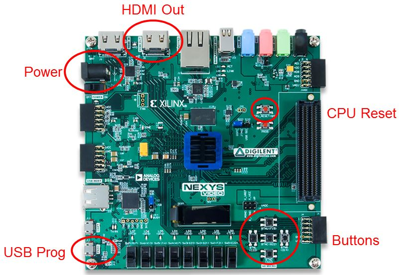
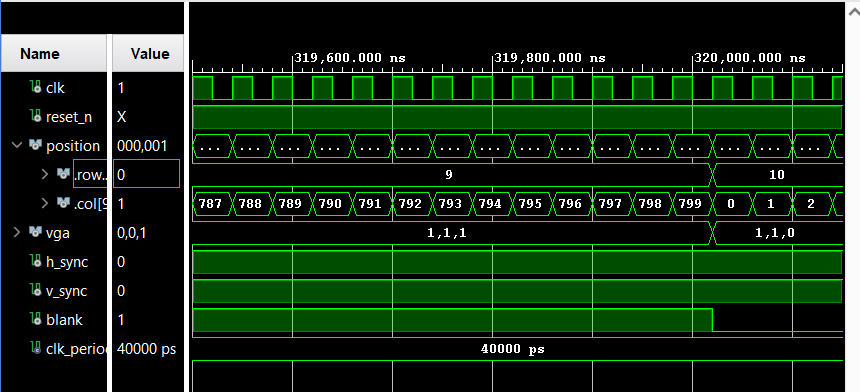
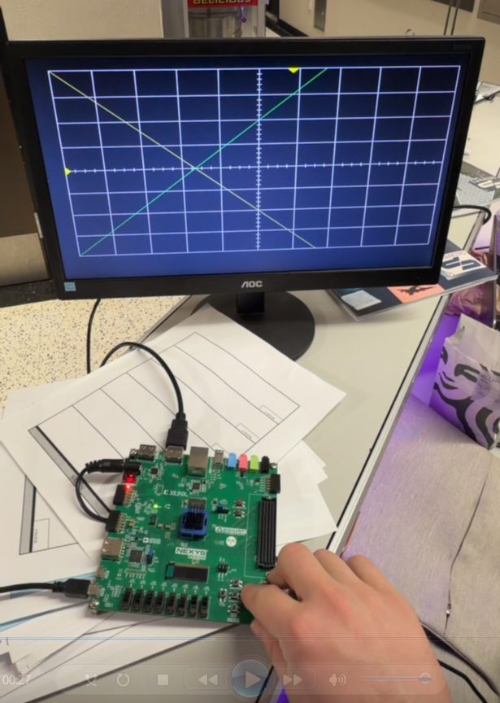

# Lab 1: VGA synchronization REPORT

## Introduction
For this lab, I was tasked with writing a vga controller in VDHL and implementing it onto an FPGA development board. I then used this VGA controller to display an oscilloscope with two signals, a white with hashes, and moveable trigger indicators as shown below. The final implementation would display the interactable oscilloscope grid, triggers, and signals on a monitor through the HDMI output on the board.

## Design and Implementation
Below is ths bloack diagram for this project

### component breakdown
The VGA_signal generator keeps tracl of pixel selection and generates the synchronization signals (h_sync, v_sync) and blank signal. It accomplishes this using two counter components, the H counter being the least signifcant value which keeps track of the horizontal pixel count (col) and increases every clock cycle when enabled. When H counter reachs is max value, it's roll causes V counter to increment by 1. V counter keeps track of the vertical pixel count (row). The VGA_Signal_generator component generates it's vsync, hsync, and blank signals based of the current pixel (determined by row and col outputs from the counters) as shown in the diagram below.

The color_mapper component is a sub-component of the overall VGA component and contains the logic for each individual pixel drawn when the blank signal is low and sync is high. The gridline and grid hashes are drawn a shown below in the grid diagram: 9 vertical lines and 7 horizontal with 3 vertical hashes and 4 horizonal hashes. Color_mapper also contains the colors for ch1 and ch2, but only draws them based off the channel active signal inputs into the VGA component. Color mapper also contains the logic for drawing the triangular trigger markers (time and voltage triggers) and draws them pased on positional information from the 'trigger' input.

grid diagram

The Video component ties the VGA and DVID components together, and also contains the clock_wiz module. The DVID component was provided to me for this project and handles the interface between the code and HDMI output signals (tmds / tmdsb). The Clock_wiz_0 is a tool that converts the FPGA board's 100MHz clock signal into 3 unique clk signals, one 25MHz for the VGA component and two 12 MHz for the DVID component.

The Overarching Lab 1 entity mainly handles the connection between hardware inputs and the Video Module. The two numeric_stepper components control the position of the volt and time triggers. These numeric steppers can be incremented/decremented based off of button inputs from the FPGA board shown in the picture below. They steppers output a signed 11-bit logic vector that is converted into an 11-bit unsigned value that the trigger signal can pass into the video and VGA components. The CPU Reset button controls the main reset signal for the entity. The two rightmost switches at the very bottom of the board control the 'enable' signal for channel 1 and channel 2.

## Test/Debug

This project utilized 3 test benches to verify the individual functionality of the counter, vga_signal_generator, color mapper, and numerical stepper components. 

Instructor_tb generated a visual waveform and tested key values for the implementation of the counter and vga_signal_generator components. This ensured that the componentes generator the correct VGA signal for our 480x640 pixel display, with the correct coordinates and v_sync, h_sync, and blank signals for the coordinates as shown in 'VGA test signal' images below. Gate check 1 and gate check 2 were both accomplished using this test bench.

This screenshot shows the column count (col) rolling over and incrementing the row count (row)

This screenshot below shows the hsync and blank signals reacting to the column count

This screenshot below shows the vsync and blank signals reacting both the column and row counts

vga_log_tb produced a text file containing the vga signal data with colors from the color_mapper component. This file could then be placed into a program to ensure the oscilloscope display would be rendered properly before integrating onto hardware. the screenshot below shows the output from this testbench after the components were coded. (note: the channels had the wrong colors in this test)

numeric_stepper_tb ensured that the numeric steppers worked properly. This testbench was provided to me. It asserts that critical values are correct and also provides a waveform showing that the component works as intended. No issues arose during testing.

In gate check two (instructor_tb), I ran into multiple problems where signals were updating a clock cycle too late, causing unwanted behavior with the blank signal. This was due to logic errors within my my ranges for each signals duration in vga_signal_generator. Adjusting these ranges down by 1 fixed the problem.

When I completed all parts and started generating the bitstream for the FPGA board, I failed multiple times due to improperly connecting signals and components in the lab1.vhd file. Most of these issues resulted from me copy/pasting code from other source files and forgetting to adjust the right values/ Thanks to the error messages these were easy to find and fix, yet this taught me to be more methodical when writing the top-level code for projects like this in the future.

I found out that different monitors can yield unexpected results with the HDMI interface. My two personal monitors both had unique issues diplaying the signal from the FPGA board that worked perfectly on the monitors in the lab. my 1080p portable monitor only displayed in black and white, as well as squashing the image to only the top-half of the monitor, and my 1440p gaming monitor refused to display anything despite the power being on. I'm curious as to why these monitors behaved in this way.

## Results
Gate check 1: functionality of the CGA counter components was completed and passed testing on 1/21. This milestone was fully achieved visual inspection of the waveforms behavior as h_count and v_count increased.

Gate check 2: the Vsync, hsync, and blank signals in the VGA_signal_generator were fully functional and passed testing on 1/23. The Color_mapper was able to diplay a fully Red screen on this date as well. This milestone was fully achieved as shown by passing all tests in the instructor_tb testbench and fully red screen demo'd in class on 1/23 using the output file from vga_log_tb.

The color mapper was completed and filly functional on 1/27 at 10:24 as shown in the image below using vga_log_tb.

The numeric stepper was completed and passed all tests in numeric_stepper_tb on 1/27 at 23:08.

the required functionality and additional functionality requirements for this lab were completed on 1/28 at 18:37 simultaneously. Both levels of functionality were fully achieved as demonstrated in a video demo sent to Lt. Col. Trimble on the same day at 21:12. A screenshot of the implementation being displayed on a monitor is shown below (screenshot from the video demo)

## Conclusion
This lab really help me understand how video signals work down in terms of signals in a hands-on way. Having to program each component allowed me to get a deep understanding of how every pixel has to be scanned over and assigned a color value in order to displat an image on a monitor. I had to struggle with unexpected behavior in signals and learned how to effectively debug using the test benches and consol messages when making the VGA_signal_generator component. I also learned to be more careful when copy/pasting while writing code as I sometimes forgot to change values that emded up causing problems later down the line.

The lectures leading up to this lab did a great job giving us the information we needed to be successful while still leaving many aspects of the problem for us to discover and solve on our own. Making the counter component during HW4 really helped when it came to making the numeric_stepper for this lab since it was practically the same thing except with the ability to count both up and down depending on inputs. The difficulty was perfect and having multiple days to talk with instructors and classmates ensured that I did not get hopelessly stuck on one thing. This lab was well-paced. The ece383.pkg file also helped a ton with making my code readable and easy to follow, it was a great addition to the Lab. One reccomendation I have for the future would be to name the test benches more appropriately for future classes, since the naming shcemes for this one made it hard to figure out which components they were analysing without actively looking through the testbench code.