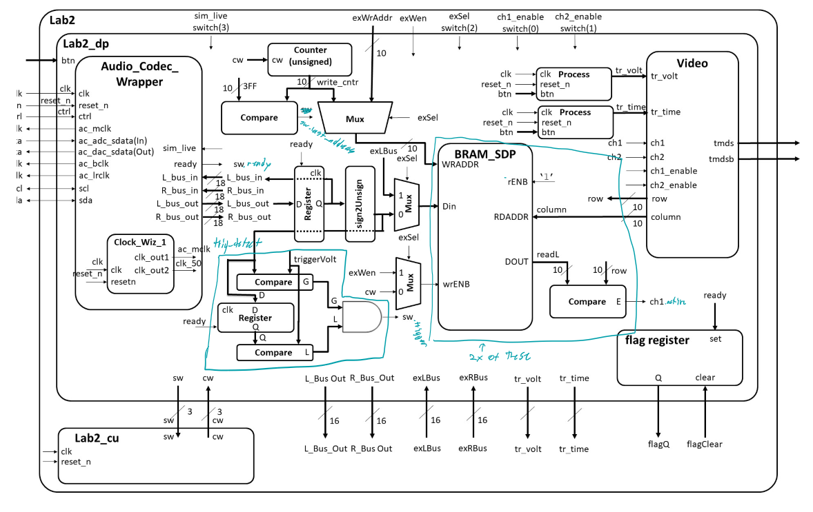
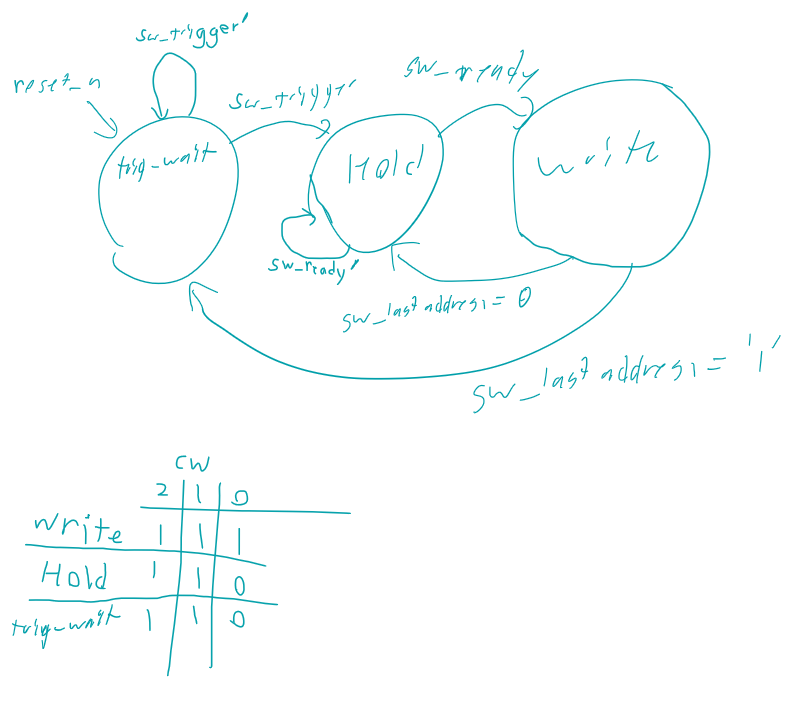
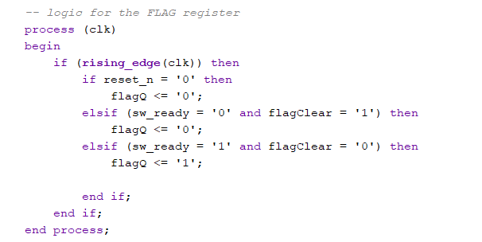

# Lab 2: Data Acquisition, Storage and Display REPORT

## Introduction
This lab involved integrating the video controller from lab 1 with BRAM and an audio codec in order to create a 2-channel oscilloscope that can display audio signals from an audio input. It also involved creating input feedback for the audio signals and creating a basic voltage trigger to prevent our signals from constantly scrolling across the screen.

## Design and Implementation
Below is the Block diagram for the datapath of this lab

### Component Breakdown
The BRAM_SDP is an 18kb BRAM module. This lab contains two of them, one for each signal channel which stores the voltage values for our signals to be diplayed by the video module. The video module sends it's current row and column as it is scanning the screen to the BRAM to determine when a pixel is display a signal from the channels. The compare module take the signal from the BRAM and compares it with the correlating row. When they are equal, the ch1.active signal tells the video module to display the corresponding channel color (yellow for ch1, green for ch2) on that pixel.

The counter module at the top of the diagram keeps track of which address of the BRAM is currently being accessed. When the last address is reached, it activates the sw_last_adresss signal.

The trig_detect module contains components that are used to determine when the control unit should begin writing values to the screen. For now, this is only a voltage trigger for ch1. This component compares the current values from the BRAM module with the trigger value set from user input. When the trigger value is between the current and previous values from the audio-codec, the sw_trigger switch wire triggers which allows the control unit to move the system into the "writing" state, which will begin displaying signals onto the oscilloscope.

Taking step back, the audio_codec wrapper handles the live signal logic from the audio input and Also contains "simulated signal" mode which will display an two exmaple signals used for testing. These can be selected using switch(3) on the Video FPGA board. This module was provided to us for this lab. However, the output from the audio coded required some processing before being fed into the BRAM, which is that the centermost components of the datapath handle. The values from the codec are converted from signed values into unsigned values and also are fed back into the audio codec so that we can hear the signal through external speakers while seeing it on the oscilloscope.

For debugging purposes, the OLED screen on the FPGA board was enabled by code proveded from our instructor. This code was within the Lab2 entity and did not have any effect on the contents of the datapath module.

### Control Unit
Below is the control unit state diagram for the lab

This control unit initializes at the "TRIG_WAIT" state. When the sw_trigger signal wire is activated from the trig_detect module described above, the control unit moves into a loop between the HOLD and WRITE states. The sw_ready signal from the audio Codec allows the control unit to move into the write state, which is the only state that enables the BRAM (cw(0)) to begin writing values from the Data input. This loop will continue until the last address of the BRAM is reached (communicated by sw_last_address) which will reset the FSM back to the WAIT_TRIG. An active low reset will reset the FSM back to the WAIT_TRIG state.

## Test/Debug
The testing for this lab was primarily done on hardware simulations and not testbenches. These hardware tests were split into 3 Gate Checks and a final A/B functionality demonstration. 

testing for Gate Check 1 ensured that Data from the BRAM modules could be passed into the video module and properly displayed on a screen through an HDMI Connection. For this state, the memory values were hard-coded into the BRAM and effectively immutable. The main challenge leading up to this test was ensuring that the BRAM modules were weired correctly to other modules and that unneccesary modules were commented out before implementation for the testing. This also involved making a smaller, two0state FSM for the control unit that only contained the HOLD and WRITE states. This was tested through a hardware demonstration and had no issues.

The requirements for Gate Check 2 and 3 both related to connecting the Audio Codec module to the BRAM. During this phase I also begam implementing the exSel functionality and muxes which will be used for later labs. Gate Check 2 tested a simulated signal through the audio Codec and Gate check 3 implemented a live audio input. Either of these tests could be selected by flipping switch 3 on the video FPGA board. The main issue that came up when testing this functionality on hardware was that I incorrectly hooked up the FPGA switches between the exSel and Live switches. I utilized the intructor-provided OLED functionality to diagnose this bug and correct it. Both the simulated and live signals from the audio codec worked during testing with no issues.

Testing from this point on was just adding features for the A and B level functionality. In termas of making the voltage trigger work properly, I first added button functionality with proper debouncing and did a hardware implementation test to make sure the voltage and time tirgger markers worked properly with the new debouncer. After that was working, I then made the Trig_detect module to add voltage trigger functionality to the oscilloscope. I also updated the control unit FSM with the WAIT_TRIG state to enable the functionality. The trigger value was working, but the column offset was incorrect meaning that the signal was not displaying correctly. In order to fix this, I offset the trigger value that is passed into trig_detector by 30 pixels and also added a 20 pixel offset to the write_adress signal that goes into the BRAM WRADDR. This properly offset both the visible voltage trigger indicators and the signal to properly align on the oscilloscope.

The two things added to the project that have not yet been tested are the flag register and the muxes for the exSel switch. The code for these modules have been made integrated within the datapath entity. Below is a code snippet of the flag register.

## Results
The table below shows each functionality milestone's degree of completion and when it was accomplished.
| Milestone | Date/Time | Acheived |
| --- | --- | --- |
| Gate Check 1 | 2026, Feb 12th 0900 | Achieved: Demo'd that the video entity worked with the BRAM modules in class |
| Gate Check 2 | 2026, Feb 17th 0740 | Achieved: Demo'd (in class) that the simulated singal from the audio codec entity was displayed |
| Gate Check 3 | 2026, Feb 17th 0830 | Achieved: Demo'd (in class) that an audio signal from my laptop was displayed |
| Required Functionality | 2026, Feb 23th 0917 | Achieved: Demo'd with A/B functionality, the signal is held in place by the votage trigger and the flag register is implemented |
| A and B functionality | 2026, Feb 23th 0917 | Acheived: Demo'd that the both signals (ch1 and ch2) could be held in place by a moveable voltage trigger that the signal intersects. The buttons that controlled the trigger had debouncer functionality and the time trigger could be moved as well. The flag register and exSel muxes are coded and integrated into the lab, but are untested |

## Conclusion
The most challenging part of this lab was keeping track of all the different components and signals. I learned how important a detailed datapath and control unit are for projects like this. Fully understanding how the entities interact between each other is very important and simply walking through each part helped me gain understanding of the overall project. Making sure the correct signals were being passed between modules was also chellenging during the coding portions of this project. The offsetting and parsing of different signals, along with the whole signed-to-unsiged conversion between the Audio codec and BRAM, took up a large portion of my debugging. Besides those two main challenges, this lab was actually quite easy to follow, and I was suprised how quickly everything came together to successfully display and audio signal on the oscilloscope in this lab.

The lectures leading up to this lab were very helpful in both leading to understanding of the entities/modules invovled. HW7 was also extremely helpful in enabling me to make a functional debouncer that could be easily integrated into my button code from lab 1 for this lab.  I liked the way the Gate Checks broke up this large project into manageable chunks that slowly added functionality since it made debugging and testing very easy.
