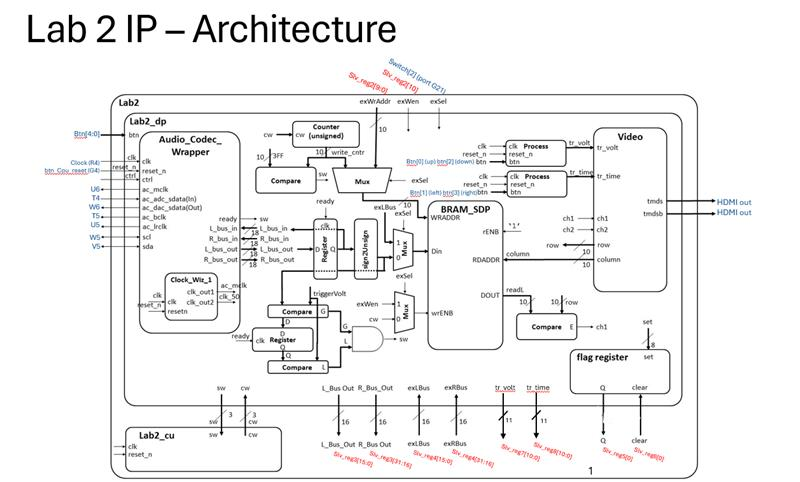
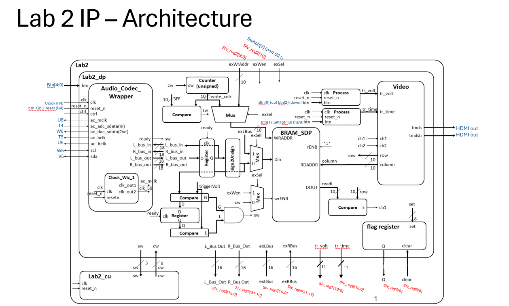

# Lab 3: Software Control of a Datapath Report
 
## Design
 
Datapath Block Diagram
 

 
Mapping of the AXI registers to their respective signals
 

 
## Results
The table below shows each functionality milestone's degree of completion and when it was accomplished.
| Milestone | Date/Time | Acheived |
| --- | --- | --- |
| Gate Check 1 | 2026, March 11, 0830 | Achieved: We uploaded our updated diagrams (seen above) to GradeScope|
| Gate Check 2 | 2026, March 13, 1130 | Achieved: Lab 2 functionality workingwith lab 3 bitstream, lab 3 project included microblaze processor. Demo'd to Col Trimble outside of class hours.|
| Gate Check 3 | 2026, March 18, 2150 | Achieved: Achieved the baby step of displaying a demo signal throigh the external Microblaze.|
| Required functionality | 2026, April 1st 920 | Acheived: Demo'd to Col Trimble in class. Audio signals were handled in arrays within the microblaze. Triggers and Channel enables are controlled by board hardware (switches and buttons). User menu is displayed and the full program operates continuously after the 'c' key is pressed. The board properly displayes the signals with triggering|
| A functionality | 2026, April 1st 920 | Acheived: Demo'd to Col Trimble in class. Audio signals were handled in arrays within the microblaze. Channel enables are controlled by board hardware (switches and buttons). Interupts are triggered by the ready bit of the flag register to upload a sample.|
 
 
## Conclusion
This lab was quite a bit more challening than labs we have done before. The biggest challenges were tracing signals down into the data path and correctly and successfully routing them up and down and back through. I believe that during the the ICEs, there was not a whole lot of understanding, rather just following directions, so when it came to implementing the rest of everything for Lab 4 and debugging issues, there was a larger knowledge gap. I would say that greater informational knowledge leading up to the lab would be beneifical. Another hurtle we ran into was a lack of knowledge when it came to Vitis, which also caused issues in regards to debugging there as well. But overall, looking back, I can say I pretty thoroughly understand what we did. It is just in the moment can be rather confusing. I believe in the future there are two best ways of thoughts. One is to give the vivado code and have cadets fill in the blanks, but that is a lot like 281 and I believe cadets would miss out on the struggle and the deeper understanding of VHDL with adding it all ourselves. Option 2 is have a cheat sheet, or a bullet by bullet reference sheet of taskers that need to be done. Like one of those taskers could be to route the signals up and down through the microblaze and data path. Another tasker coud be to connect wires on the block diagram. There could be more. But with being exhausted due to it being the drag in the middle of the semester post prog before spring break, it is harder to focus and dive into things due to burn out and exhuastion, so a little helping hand could be helpful. But all in all, learned a lot from this lab and excited for Lab 4 and the final project coming up!